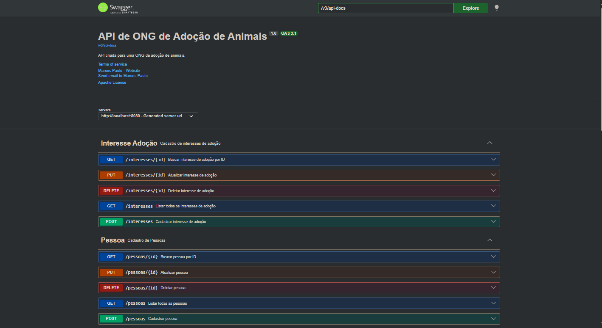

# Projeto ONG de Adoção de Animais 🐶🐱

API REST desenvolvida para gerenciamento de uma ONG de adoção de animais, permitindo o controle de animais, pessoas, endereços, características e interesses de adoção.

---

# 👨‍💻 Desenvolvedor

## Marcos Paulo

Projeto desenvolvido individualmente com foco em boas práticas no desenvolvimento de APIs REST utilizando Java e Spring Boot.

---

# 📚 Sobre o Projeto

O sistema foi desenvolvido com foco em organização arquitetural, boas práticas de desenvolvimento e separação em camadas utilizando Spring Boot.

A aplicação permite:

- Cadastro de animais
- Cadastro de pessoas
- Controle de características dos animais
- Controle de endereços
- Controle de interesses de adoção
- Relacionamentos entre entidades
- Tratamento global de exceções
- Validações de dados
- Documentação completa da API com Swagger

---

# 🚀 Tecnologias Utilizadas

- Java 17
- Spring Boot
- Spring Data JPA
- PostgreSQL
- Maven
- Swagger / OpenAPI
- Bean Validation
- Hibernate

---

# 📂 Estrutura do Projeto

```text
src/main/java
│
├── controller
├── domain
├── dto
├── repository
├── service
├── exception
└── config
```

---

# 🏗️ Arquitetura

O projeto foi estruturado utilizando separação em camadas:

- **Controller** → responsável pelos endpoints da API
- **Service** → regras de negócio
- **Repository** → acesso ao banco de dados
- **DTO** → transferência de dados
- **Exception** → tratamento global de erros

---

# 🔥 Funcionalidades

## 🐾 Animal

- Cadastrar animal
- Listar animais
- Buscar animal por ID
- Atualizar animal
- Deletar animal

---

## 🎭 Características

- Cadastrar característica
- Listar características
- Buscar característica por ID
- Atualizar característica
- Deletar característica

---

## 👤 Pessoa

- Cadastrar pessoa
- Listar pessoas
- Buscar pessoa por ID
- Atualizar pessoa
- Deletar pessoa

---

## 🏠 Endereço

- Cadastrar endereço
- Listar endereços
- Buscar endereço por ID
- Atualizar endereço
- Deletar endereço

---

## ❤️ Interesse de Adoção

- Registrar interesse de adoção
- Listar interesses
- Buscar interesse por ID
- Atualizar interesse
- Remover interesse

---

# 📌 Relacionamentos

## Animal

- Possui várias características

## Pessoa

- Possui um endereço
- Pode demonstrar interesse em adoção

## Interesse de Adoção

- Relaciona uma pessoa a um animal

---

# ⚠️ Tratamento de Exceções

A API possui tratamento global de exceções utilizando:

- `ResourceNotFoundException`
- `DuplicateEntryException`
- `GlobalExceptionHandler`

Retornando respostas padronizadas com:

- status HTTP
- mensagem de erro

---

# ✅ Validações

O projeto utiliza Bean Validation com:

- `@NotBlank`
- `@NotNull`
- `@Email`
- `@Valid`

---

# 📖 Documentação Swagger

A documentação da API pode ser acessada em:

```text
http://localhost:8080/swagger-ui/index.html
```

---

# 🖼️ Swagger da Aplicação

## Tela principal da documentação



---

# 🛠️ Como Executar o Projeto

## 1️⃣ Clonar o repositório

```bash
git clone https://github.com/marcospmelloo/Projeto-ONG-de-Adocao-de-Animais.git
```

---

## 2️⃣ Abrir o projeto

Abra o projeto em uma IDE como:

- IntelliJ IDEA
- VS Code
- Eclipse

---

## 3️⃣ Configurar o banco de dados

Criar um banco PostgreSQL e configurar o:

```properties
application.properties
```
---

## 4️⃣ Executar o projeto

Rodar a aplicação Spring Boot.

---

# 📬 Exemplos de Endpoints

## 🐾 Animal

### Listar animais

```http
GET /animais
```

---

### Buscar animal por ID

```http
GET /animais/1
```

---

### Cadastrar animal

```http
POST /animais
```

### Body

```json
{
  "nome": "Rex",
  "especie": "CACHORRO",
  "raca": "Labrador",
  "idade": 5,
  "sexo": "MACHO",
  "porte": "GRANDE",
  "statusAnimal": "DISPONIVEL",
  "vacinado": true,
  "observacao": "Animal dócil",
  "idCaracteristicas": [1, 2]
}
```

---

### Atualizar animal

```http
PUT /animais/1
```

---

### Deletar animal

```http
DELETE /animais/1
```

---

## 👤 Pessoa

### Cadastrar pessoa

```http
POST /pessoas
```

### Body

```json
{
  "nome": "Marcos Paulo",
  "cpf": "12345678909",
  "email": "marcos@email.com",
  "telefone": "22999999999",
  "dataNascimento": "2005-08-15"
}
```

---

## ❤️ Interesse de Adoção

### Registrar interesse

```http
POST /interesses
```

### Body

```json
{
  "idPessoa": 1,
  "idAnimal": 1,
  "interesse": "APROVADO",
  "observacao": "Possui espaço adequado para o animal"
}
```

---

# 🎯 Diferenciais do Projeto

✅ DTO Request/Response  
✅ Arquitetura em camadas  
✅ Tratamento global de exceções  
✅ Validação de dados  
✅ Swagger/OpenAPI  
✅ Relacionamentos entre entidades  
✅ Organização profissional de API REST  

---

# 📝 Observações

- O projeto foi desenvolvido com foco em aprendizado e aplicação prática de conceitos de API REST.
- Toda a aplicação foi estruturada utilizando boas práticas de separação em camadas.
- O Swagger foi utilizado para documentação completa dos endpoints.
- As validações foram implementadas utilizando Bean Validation.
- O tratamento de exceções foi centralizado utilizando `@RestControllerAdvice`.

---

# 👨‍💻 Autor

## Marcos Paulo

Desenvolvido para fins acadêmicos e prática de desenvolvimento backend com Spring Boot.
